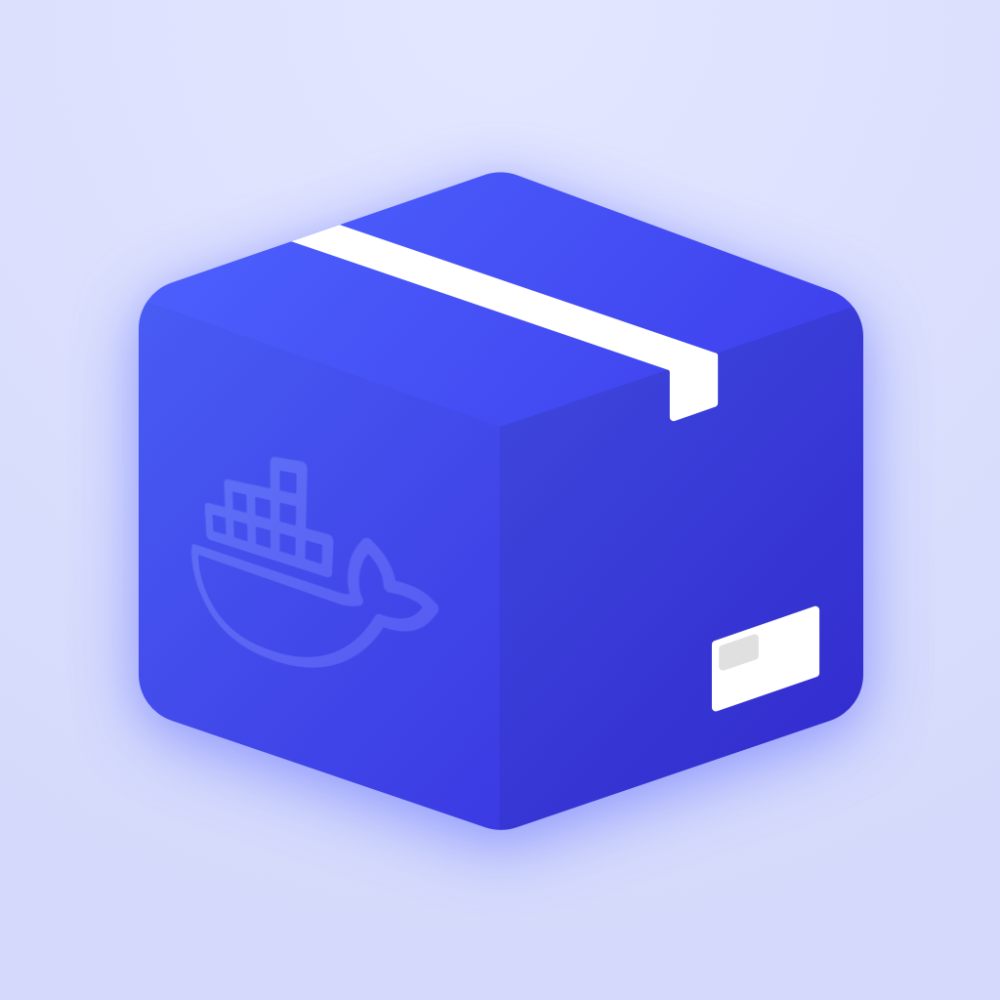

# Harbour
Docker/Portainer management app for iOS.

## Features
- [x] Multiple servers & endpoints
- [x] Managing container state
- [x] Managing stacks
- [x] Widgets
- [x] Handoff
- [x] iPadOS / macOS Catalyst support
- [x] No telemetry :)

## Installation
**Harbour is available on [TestFlight](https://testflight.apple.com/join/F2vK7xo4), and will be available on the App Store too in the near future 😄**
#### Alternative Methods
- Sideload .ipa from [releases](https://github.com/rrroyal/Harbour/releases/latest)
- Build it yourself
