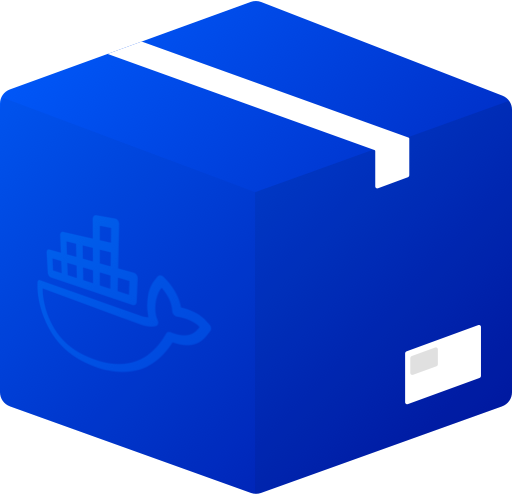
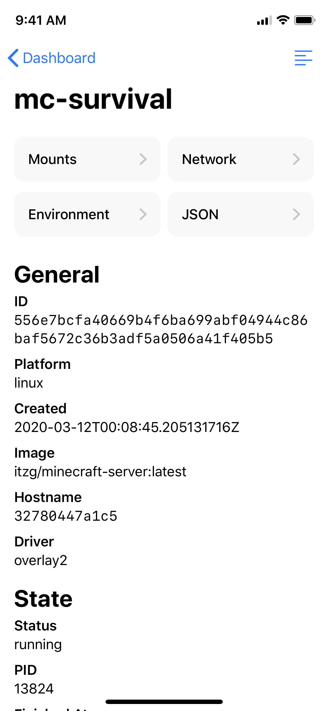
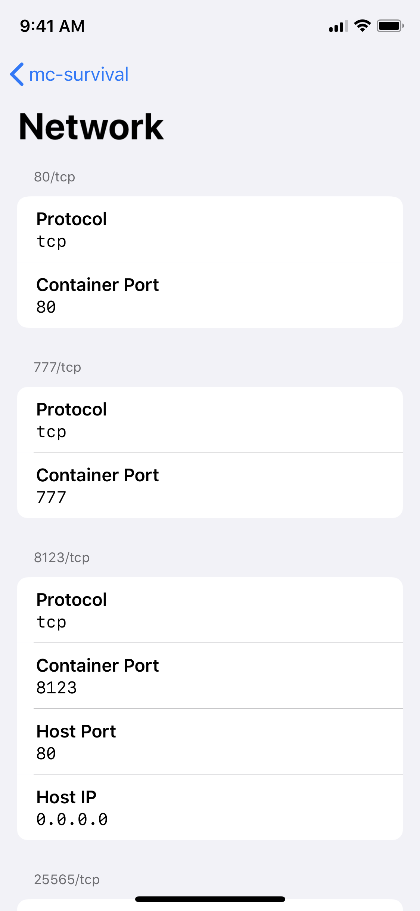

	 
	<h3 align="center">Harbour</h3>
	
Docker management app for iOS written in SwiftUI.

## Screenshots

	
	
	
	

## Features
- 100% native and made in SwiftUI
- Light and Dark Mode
- Control and inspect containers
- Display logs
- Design based on Apple's *Human Interface Guidelines*
- iPad app

## How to use

### Installation
1. Clone the repo.
2. Open the project in Xcode >= 11.4.
3. Change the Bundle Identifier and Signing Identity to your own.
4. Build and run!

### Docker setup
Download and install [Portainer](https://portainer.io). Then, login with your profile username and password in Harbour. **You can also use any other HTTP-based Docker reverse-proxy, but at this time only [Portainer](https://portainer.io) is officially supported.**

## Known bugs
- Container view doesn't update when in context menu
- NavigationView titles sometimes bug

## TODO
- [ ] Cursor support
- [ ] Battery optimization
- [ ] Localization
- [ ] Accessibility
- [ ] Shortcuts
- [ ] Fix context menu (properly scale icons, make UI update)
- [ ] Quick actions
- [ ] Allow selection of text in certain views
- [ ] Further optimization
- [ ] Fix NavigationViewTitle size bug
- [ ] CloudKit
- [ ] Stacks support
- [ ] Widget (?)
- [ ] Catalyst app
- [ ] watchOS app
- [ ] Create new containers (+ drag and drop)
- [ ] Edit containers
- [ ] Better logs support (streams)
- [ ] Notifications
- [ ] SiriKit
